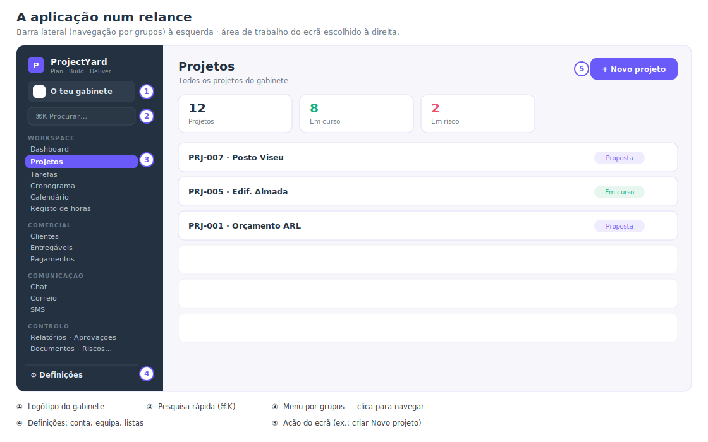
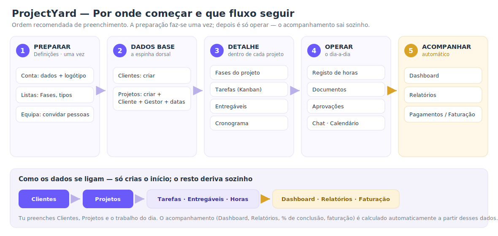

# Manual do Utilizador — ProjectYard

> Guia de arranque para gabinetes de arquitetura/engenharia.
> Mostra **por onde começar**, **que ordem seguir** e **para que serve cada ecrã**.
> Versão da app: v0.9.0 · Idioma: Português (PT-PT).

---

## 1. O que é o ProjectYard

Plataforma de **gestão e controlo de entrega de projetos**: clientes, projetos, fases, tarefas,
entregáveis, prazos (cronogramas), horas, aprovações e faturação — tudo num só sítio, isolado por gabinete (*workspace*).

A ideia-chave: **preenches o início (clientes, projetos e o trabalho do dia); o acompanhamento
(Dashboard, Relatórios, % de conclusão, faturação) é calculado automaticamente**.

---

## 2. Primeiro acesso

1. Abre o endereço da aplicação no navegador. Aparece um **ecrã de marca** (logótipo a carregar) e depois o **login**.
2. Introduz o **email** (que é o teu nome de utilizador) e a **password temporária** que te foi entregue.
3. **Muda a password** no primeiro acesso: canto inferior esquerdo → **Definições → Segurança → Alterar password**.
4. A tua conta fica **Ativa** automaticamente após o primeiro login.

> 💡 O **email é o login**. Não há nome de utilizador separado.

---

## 3. Por onde começar — o fluxo

**Primeiro, o mapa da aplicação** (barra lateral à esquerda, área de trabalho à direita):



**Depois, a ordem a seguir.** A **preparação (etapa 1)** faz-se uma vez; depois é sempre o mesmo ciclo.



| # | Etapa | Onde | O que fazes |
|---|---|---|---|
| **1** | **Preparar** | Definições | Dados do gabinete + logótipo · Listas (Fases, tipos) · Convidar a equipa |
| **2** | **Dados base** | Clientes → Projetos | Criar os clientes; depois os projetos (com Cliente, Gestor e datas) |
| **3** | **Detalhe** | dentro do Projeto | Fases · Tarefas · Entregáveis · Cronograma |
| **4** | **Operar** | dia-a-dia | Registo de horas · Documentos · Aprovações · Chat/Calendário |
| **5** | **Acompanhar** | automático | Dashboard · Relatórios · Pagamentos/Faturação |

---

## 4. Passo-a-passo

### Etapa 1 — Preparar (Definições)

**Definições → Conta**
- Preenche os dados do gabinete (nome, NIF, morada, website, email de faturação).
- **Carrega o logótipo** (JPG/PNG/WebP) — aparece na barra lateral, junto ao nome do workspace.

**Definições → Listas**
- Ajusta o vocabulário do gabinete: **Fases** (ex.: Estudo Prévio · Licenciamento · Execução · Obra · Assistência Técnica · Fecho), prioridades e tipos.
- Podes **adicionar, renomear, recolorir ou remover** cada valor.

**Definições → Equipa & permissões**
- **Convidar por email** cria já o login da pessoa, com uma **password temporária** mostrada **uma única vez** (copia-a e partilha-a em segurança).
- Define o **papel** de cada pessoa (ver secção 6). Podes mudar o papel mais tarde.

### Etapa 2 — Dados base

**Clientes → Novo cliente**
- Cria cada cliente. Mínimo: o **nome/empresa**. NIF, contacto, email e telefone podem ficar para depois.

**Projetos → Novo projeto**
- Cria cada projeto e preenche:
  - **Código** (ex.: `PRJ-001`) e **Nome**.
  - **Cliente** (da lista que criaste) e **Gestor** (responsável).
  - **Estado** (Proposta · Em curso · Em risco · Concluído · Suspenso · Cancelado) e **Prioridade**.
  - **Datas** previstas de início/fim (alimentam o cronograma).
- Honorários, horas e % de conclusão **não se escrevem aqui** — resultam do detalhe (mais fiável).

### Etapa 3 — Detalhe de cada projeto

Abre um projeto e trabalha o seu interior:
- **Fases** — as etapas do projeto e o seu progresso.
- **Tarefas (Kanban)** — arrasta entre *A fazer → Em curso → Em revisão → Concluído*; com responsável, prazo, etiquetas, checklist e comentários.
- **Entregáveis** — peças/documentos a entregar, com **versões** e estado (Rascunho → Em revisão → Em aprovação → Aprovado).
- **Cronograma** — barras de prazo (previsto vs real); atrasos a vermelho.

### Etapa 4 — Operar (dia-a-dia)

- **Registo de horas** — cada pessoa lança as horas por projeto/fase. Alimenta o custo de produção dos Relatórios.
- **Documentos** — repositório de ficheiros do projeto.
- **Aprovações** — pedidos de decisão (entregáveis, change requests, pagamentos); aprovar ou **devolver com motivo**.
- **Chat** — canais por projeto e mensagens diretas, isolados por gabinete.
- **Calendário** — eventos e marcos. **Correio** e **SMS** ficam disponíveis quando ativados.

### Etapa 5 — Acompanhar (sai sozinho)

- **Dashboard** — visão geral (projetos, prazos, alertas).
- **Relatórios** — produtividade, custos, desvios de prazo (semáforos).
- **Pagamentos** — milestones e faturas; uma aprovação pode desbloquear um milestone.
- **Riscos** e **Cronograma global** — visão transversal a todos os projetos.

---

## 5. Como os dados se ligam

```
Clientes ─▶ Projetos ─▶ (Tarefas · Entregáveis · Registo de horas)
                                   │
                                   ▼
                 Dashboard · Relatórios · Faturação  (automático)
```

Só preenches **Clientes**, **Projetos** e o **trabalho do dia**. O acompanhamento é **derivado** desses dados — não precisas de o escrever à mão.

---

## 6. Papéis e permissões (resumo)

| Papel | Pode |
|---|---|
| **Owner** | Tudo no gabinete: equipa, faturação, definições. |
| **Administrador** | Gerir o gabinete e a equipa. |
| **Gestor** | Criar/gerir projetos, clientes, tarefas e entregáveis. |
| **Membro** | Trabalhar nos projetos onde está (tarefas, horas, ficheiros). |
| **Cliente** | Acesso restrito (em desenho). |

> Detalhe completo em [Papeis-e-Permissoes.md](Papeis-e-Permissoes.md).

---

## 7. Boas práticas

- **Segue a ordem**: Clientes → Projetos antes de criar tarefas/entregáveis (precisam do projeto).
- **Usa códigos consistentes** nos projetos (`PRJ-NNN`).
- **Lança horas regularmente** — é o que dá fiabilidade aos custos e à produtividade.
- **Não escrevas totais à mão** (horas/faturado/%): deixa-os derivar do detalhe.
- **Partilha as passwords temporárias em segurança** e pede a cada pessoa para a mudar no 1.º acesso.

---

## 8. Perguntas frequentes

**Esqueci-me da password.** Como o envio de email ainda não está ativo, pede a um **administrador** para a **redefinir** (gera uma nova password temporária).

**Onde mudo a minha password?** Definições → Segurança → Alterar password.

**O logótipo não aparece.** Confirma que foi carregado em Definições → Conta (formatos JPG/PNG/WebP, até 2 MB).

**Posso apagar um cliente/projeto?** Editam-se a qualquer momento; o estado *Cancelado* (projetos) mantém o histórico sem apagar.

**Os números do Dashboard estão a zero.** São derivados — aparecem à medida que crias projetos, lanças horas e atualizas tarefas/entregáveis.

---

## 9. Capturas de ecrã (para completar)

Este manual já traz **dois visuais** (o *mapa da aplicação* e o *fluxo*). Para juntar **capturas de ecrã reais**, é simples:

1. Na app, abre o ecrã, faz a captura (Windows: **`Win`+`Shift`+`S`**) e guarda em **`Docs/img/`** com o nome indicado.
2. No sítio certo do manual, cola a linha de imagem correspondente (ver lista). Aparece automaticamente.

| Ficheiro a guardar em `Docs/img/` | Ecrã a capturar | Entra na secção |
|---|---|---|
| `01-login.png` | Ecrã de entrada (login) | 2. Primeiro acesso |
| `02-definicoes-equipa.png` | Definições → Equipa & permissões | 4 · Etapa 1 |
| `03-clientes.png` | Clientes (lista) | 4 · Etapa 2 |
| `04-novo-projeto.png` | Projetos → Novo projeto (formulário) | 4 · Etapa 2 |
| `05-tarefas-kanban.png` | Um projeto → Tarefas (Kanban) | 4 · Etapa 3 |
| `06-dashboard.png` | Dashboard | 4 · Etapa 5 |

Exemplo de linha a colar (ajusta o nome): ``

> Ver [img/README.md](img/README.md) para a lista e dicas de captura.
